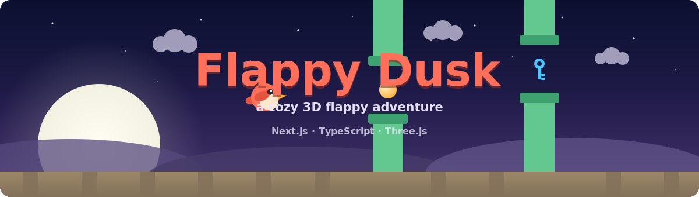

<p align="center">
  <picture>
    <source media="(prefers-color-scheme: light)" srcset="docs/banner.svg">
    
  </picture>
</p>

<h1 align="center">Flappy Dusk</h1>

<p align="center">
  A pretty, playable <b>3D flappy-bird</b> game — coins, power-ups, rare keys,
  daily missions, levels, a bird shop, a day/night sky,<br>
  and a global leaderboard whose scores <b>cannot be forged</b>.
</p>

<p align="center">
  <a href="https://github.com/subhm2004/Flappy-Dusk/actions/workflows/ci.yml">
    
  </a>
  
  
  
  
  
  
  
</p>

<p align="center">
  <a href="https://flappy-dusk.vercel.app">
    
  </a>
  &nbsp;
  <a href="https://github.com/subhm2004/Flappy-Dusk/releases/latest/download/flappy-dusk.apk">
    
  </a>
</p>

---

## Contents

- [What this is](#what-this-is)
- [Play it](#play-it)
- [Features](#features)
- [Controls](#controls)
- [How to play](#how-to-play)
- [Architecture](#architecture)
- [Project structure](#project-structure)
- [How it works](#how-it-works)
- [The leaderboard, and why it can't be lied to](#the-leaderboard-and-why-it-cant-be-lied-to)
- [Signing in with Google](#signing-in-with-google)
- [API reference](#api-reference)
- [Database](#database)
- [Getting started](#getting-started)
- [Environment variables](#environment-variables)
- [Scripts](#scripts)
- [Testing](#testing)
- [Deploying](#deploying)
- [Roadmap](#roadmap)
- [License](#license)

---

## What this is

**Flappy Dusk** reimagines tap-to-fly gameplay as a warm, papercraft 3D scene at
sunset — a round little finch, drifting clouds, violet dunes, a glowing sun on
the horizon — all rendered in real time with Three.js. Stay out past seven and
the sky turns to night, the sun becomes a moon, and the bird starts to glow.

Under the pretty surface it's built like a real game, and then like a real
product:

- The **game core is pure** — no DOM, no Three.js, fully deterministic given a
  seed. It runs headlessly in unit tests, and it runs *again* on the server.
- The **renderer is imperative**, driving a fixed-timestep loop at 120 Hz, so the
  animation never triggers a React re-render.
- **React owns the meta-game** — currencies, shop, missions, levels, settings —
  and talks to the engine through a small ref bridge.
- The **leaderboard verifies scores by replaying them.** The game never sends a
  number it wants believed; it sends the inputs, and the server works the score
  out for itself.

---

## Play it

**🌐 In the browser** — **[flappy-dusk.vercel.app](https://flappy-dusk.vercel.app)**.
Nothing to install. Progress is saved locally; sign in only if you want to be ranked.

**🤖 On Android** — **[flappy-dusk.apk](https://github.com/subhm2004/Flappy-Dusk/releases/latest/download/flappy-dusk.apk)**
from the [latest release](https://github.com/subhm2004/Flappy-Dusk/releases/latest).
The same game in a native shell — it plays fully offline, and posts to the
leaderboard when it can reach the network.

<details>
<summary><b>Installing the APK</b></summary>

<br>

1. Open the download link on the phone, or copy the `.apk` across.
2. Tap it. Android will ask you to allow **Install unknown apps** for whichever
   app you opened it from — Chrome, Files, whatever. Allow it.
3. Play Protect will warn you too. Tap **Install anyway**.

Both prompts are expected: the APK is **debug-signed**, not distributed through
the Play Store. Fine for playing yourself and handing to friends.

> **Uninstall any older build first.** Every CI run signs with a fresh debug key,
> and Android refuses a differently-signed upgrade with *"App not installed"*.

</details>

---

## Features

### 🎮 Core gameplay

- **Fixed-timestep physics at 120 Hz**, rendered at whatever rate the display
  runs. Frame rate never changes the difficulty.
- **Procedurally generated pipes** from a seeded PRNG (Mulberry32) — an entire
  run is reproducible from four numbers.
- Bird tilt tied to velocity, flapping wings, flap puffs, and a death tumble.
- Speed ramps with your score *and* with your level, and caps out.

### 🪙 Coins & the bird shop

- Coins float **inside the pipe gaps** — the ones near an edge make you fly close
  to a pipe to take them. **68%** of pipes carry one.
- Six bird skins: **Coral** (free) · **Bluebird** · **Mint** · **Grape** ·
  **Sunny** · **Ember**. The bird recolours live, and its glow follows the skin.

### 🔑 Rare blue keys & continues

- A glowing **blue key** appears in only **2%** of pipes.
- On death you can spend keys to **continue the same run** instead of ending it.
- The price **escalates within a run** — `1 → 4 → 8 → 18 → 32 …` — so repeated
  saves hurt, and the fifth is the last one a sane player buys.
- Short on luck? The shop sells them, cheaper in bulk:

  | Bundle | Cost | Coins per key |
  |---|---|---|
  | 1 key | 1,000 coins | 1,000 |
  | 3 keys | 1,700 coins | ~567 |
  | 5 keys ★ | 2,200 coins | 440 |

### ⚡ Power-ups

Found in **9%** of pipes.

| | Power-up | Effect |
|---|---|---|
| 🛡 | **Shield** | Absorbs one otherwise-fatal hit, plus a brief grace window |
| 🧲 | **Magnet** | Pulls nearby coins toward the bird for 6s |
| 🐢 | **Slow-mo** | Slows the world to 55% for 5s |
| ⚡ | **Fast-mo** | Speeds the world to 160% for 5s — risk for reward |

A HUD strip shows what's active and how long it has left.

### 📈 Levels, missions & achievements

- **3 daily missions**, seeded by the date — the same three for everyone, every
  day. Collect coins, score N in a run, grab power-ups, play N games, find keys.
- **11 achievements** — First Flight, High Flyer, Coin Hoarder, Locksmith,
  Rising Star, Fashionista, and more.
- **Levels** — missions and achievements pay XP; filling the bar levels you up,
  and **each level nudges the base speed up**. The game grows with you, and it
  grows harder.

### 🎨 Pipe tiers

The pipes recolour as you climb, so a long run *looks* like a long run:

| Score | Tier | |
|---|---|---|
| 0 | **Grove** | the green you start with |
| 50 | **Amber** | 🟧 |
| 100 | **Orchid** | 🟪 |
| 150 | **Ember** | 🟥 |

### 🌙 Dusk or night

A second sky, and **Auto** follows your clock — **night from 7pm to 6am**,
rolling over mid-run if you're still flying at seven.

Night isn't a filter over the top. Everything the scene paints comes from a
theme: the sky gradient, the haze, both lights, the disc on the horizon (sun →
moon), the sand, the dunes, the clouds. And because moonlight is *deliberately*
weak, **the bird, the pipes and the pickups light themselves** — with their own
colour, so a coral bird glows coral and an Ember pipe glows red. The sky goes
deep indigo without taking the gameplay with it.

### 🏆 Global leaderboard

- **Sign in with Google.** Your name and picture come straight from your account.
- Every finished run is ranked — **continues included**.
- Medals for the top three, your own row highlighted, your rank in the header.
- **Scores are verified, not trusted** — see
  [below](#the-leaderboard-and-why-it-cant-be-lied-to).
- Entirely optional: with no API configured the game is exactly what it was —
  offline, local, no sign-in, and the leaderboard button simply isn't there.

### ✨ Polish

- Medals on game over — Bronze / Silver / Gold / Platinum.
- Screen shake, death flash, and coloured tints while slow/fast-mo is running.
- Mobile **haptics** on flap, coin, key, power-up and death.
- Procedural audio from Web Audio oscillators — **zero audio assets**.
- Pause, including an automatic one when the tab loses focus.
- Everything honours `prefers-reduced-motion`.
- All progress persists in `localStorage`.
- The camera **fits itself to your screen**, so a phone held upright is playable.

---

## Controls

| Action | Input |
|---|---|
| Flap | **Tap** / **Click** / `Space` / `↑` / `W` |
| Pause | `P` / `Esc` / the ⏸ button |
| Mute | `M` / the 🔊 button |

---

## How to play

1. The **home screen** shows your best, level, coins and keys. Hit **▶ Play**.
2. Flap to thread the gaps. Every pipe you pass is **+1**.
3. Grab **coins** for the shop, **power-ups** for an edge, and **keys** to buy
   yourself a second chance.
4. When you die you can **continue** with keys — or take the medal and go again.
5. Finish **daily missions** and **achievements** to earn XP and level up.
   Careful: higher levels start faster.
6. Sign in to have your runs ranked against everyone else's.

---

## Architecture

Three workspaces in one repo. The game core sits in the middle because *both*
sides need it — the browser to play a run, the server to prove it.

```
                      ┌─────────────────┐
                      │  shared/        │   pure · deterministic · DOM-free
                      │  @flappy/core   │   physics · progression · replay
                      └────────┬────────┘
                               │  imported by both
              ┌────────────────┴────────────────┐
              ▼                                 ▼
     ┌─────────────────┐    run inputs  ┌──────────────────┐
     │  frontend/      │───────────────▶│  backend/        │
     │  Next + Three   │                │  Fastify         │
     │                 │◀───────────────│  replays the run │
     │  static export  │ verified score │                  │
     └────────┬────────┘                └────────┬─────────┘
              │                                  │
      ┌───────┴────────┐                         ▼
      ▼                ▼                    ┌──────────┐
  ┌────────┐    ┌────────────┐              │   Neon   │
  │ Vercel │    │ Capacitor  │              │ Postgres │
  │  (web) │    │  → the APK │              └──────────┘
  └────────┘    └────────────┘
                                            API on Render
```

The same `step()` runs in your browser at 120 Hz and on the server when your
score is checked. That is the whole trick, and everything else follows from it.

---

## Project structure

```
flappy-dusk/
├── package.json                  npm workspaces root
│
├── shared/                       @flappy/core — the game, as pure logic
│   ├── package.json
│   └── src/
│       ├── gameLogic.ts          physics, pipes, pickups, collisions, scoring
│       ├── gameLogic.test.ts       39 tests
│       ├── progression.ts        XP curve, levels, daily missions, achievements
│       ├── progression.test.ts     14 tests
│       ├── replay.ts             re-runs a submitted run to verify its score
│       ├── replay.test.ts          15 tests
│       ├── shop.ts               key bundles and the coin economy
│       ├── tiers.ts              pipe colours at 50 / 100 / 150
│       ├── shop.test.ts            9 tests (shop + tiers)
│       └── index.ts              the barrel both sides import
│
├── frontend/                     the game
│   ├── app/
│   │   ├── layout.tsx            root layout, metadata, viewport
│   │   ├── page.tsx              mounts the game
│   │   ├── globals.css           reset, fonts, theme tokens
│   │   ├── icon.svg              favicon — the coral bird
│   │   └── auth/callback/        where Google sign-in lands on the web
│   ├── components/
│   │   ├── FlappyDusk.tsx        the whole client: Three.js scene, game loop,
│   │   │                         HUD, home, shop, missions, settings,
│   │   │                         leaderboard, game over
│   │   └── FlappyDusk.module.css every panel, every chip, every toast
│   ├── lib/
│   │   ├── skins.ts              the six birds
│   │   ├── theme.ts              the dusk and night skies
│   │   ├── api.ts                leaderboard client
│   │   └── auth.ts               Google sign-in (system browser + deep link)
│   ├── assets/                   icon + splash source art for the APK
│   ├── scripts/
│   │   └── android-deeplink.mjs  registers the sign-in scheme in the manifest
│   ├── capacitor.config.ts       wraps the static export in an Android WebView
│   └── next.config.mjs           static export, base path, shared-core transpile
│
├── backend/                      the leaderboard API
│   ├── src/
│   │   ├── index.ts              Fastify bootstrap + CORS
│   │   ├── env.ts                every secret, validated at boot
│   │   ├── db/
│   │   │   ├── schema.ts         users + runs (Drizzle)
│   │   │   └── index.ts          Postgres connection
│   │   ├── auth/
│   │   │   ├── google.ts         trades a code for a profile
│   │   │   └── jwt.ts            signs sessions and the OAuth state
│   │   └── routes/
│   │       ├── auth.ts           sign-in for the web and the app
│   │       ├── guard.ts          requires a session
│   │       ├── runs.ts           scores a run by replaying it
│   │       └── leaderboard.ts    ranks players by their best run
│   ├── Dockerfile                built from the repo root — it needs shared/
│   ├── docker-compose.yml        Postgres + API, if you want them locally
│   ├── drizzle.config.ts
│   └── .env.example
│
├── .github/workflows/
│   ├── ci.yml                    typecheck · test · build, on Node 20 and 22
│   └── android.yml               builds the APK, attaches it to v* releases
│
├── docs/                         banner art (dusk + night)
├── DEPLOYMENT.md                 Vercel · Neon · Render · Google Cloud · APK
└── LICENSE                       MIT
```

> Neither `frontend/android/` nor `frontend/out/` is committed. Capacitor and
> Next regenerate them on every build, so there's no native project to drift out
> of sync — the launcher icon, the splash screens and the deep-link
> intent-filter are all re-applied from source on every run.

---

## How it works

### The pure core

`shared/src/gameLogic.ts` knows nothing about the DOM, about React, or about
Three.js. It's a state machine:

```ts
const state = createState(seed, baseSpeed);   // deterministic field from a seed
flap(state);                                  // impulse
const ev = step(state, C.DT);                 // advance exactly one tick
// ev: { scored, coined, keyed, powered, power, shieldUsed, died }
```

Everything the game *is* — gravity, pipe spawning, coin and key placement,
power-up rolls, collisions, scoring — lives in `step()`, and `step()` reads
nothing but its arguments. Randomness comes from a **seeded Mulberry32 PRNG**
carried on the state, so the same seed produces the same run, every time,
forever.

That property isn't a nicety. It's what makes the tests headless, and it's what
makes the leaderboard trustworthy.

### The renderer

`FlappyDusk.tsx` runs an imperative loop with a **fixed-timestep accumulator**:

```ts
acc += deltaSeconds;
while (acc >= C.DT) {          // C.DT = 1/120
  const ev = step(state, C.DT);
  // …drain the events: score, coin, key, power-up, death
  acc -= C.DT;
}
renderer.render(scene, camera);
```

Physics always advances in exact 1/120s ticks no matter what the display is
doing, so a 144 Hz monitor and a stuttering phone play the *same game*. The loop
touches Three.js objects directly and never calls `setState`, so nothing in here
can trigger a React re-render.

Pipes, coins, keys and power-ups come from **object pools** — eight of each,
recycled as they scroll past — so a long run allocates nothing.

### Fitting the camera to the screen

A perspective camera has a fixed *vertical* FOV, which means the visible **width**
is whatever the aspect ratio hands you. At a fixed distance, a phone held upright
(9:20) sees about **6 world units** across — and the pipes are 6.8 apart. A pipe
would appear at the right edge and reach the bird in under a second.

So the camera isn't pinned at a distance. It's **fitted to a target box**: enough
height for the whole playfield, and enough width that there's always a fixed
stretch of runway visible ahead of the bird. On a wide screen the width comes
free and this resolves to the original framing; on a tall phone it backs off
until the bird can actually see what's coming — about **1.7 seconds** of warning
instead of 0.7.

### The React ↔ engine bridge

React never drives a frame. It hands the engine a small imperative API, and
receives events back through refs:

```ts
interface EngineApi {
  applySkin: (skin: Skin) => void;
  applyTheme: (theme: Theme) => void;
  revive: () => void;
  restart: () => void;
  refreshBaseSpeed: () => void;
}
```

The engine calls back through `onPhaseRef`, `onRunEndRef`, `onTierRef` — plain
mutable refs, reassigned on every render, so the callbacks always close over
fresh state without the loop ever depending on React's lifecycle.

### Theming

The scene keeps its sky and ground as **canvas textures**, and its bird, pipes and
pickups on **shared materials**. Switching to night doesn't rebuild anything: it
redraws two canvases in place and writes new colours into a handful of materials.
Cheap enough to run mid-run — which is exactly what happens when 7pm arrives
while you're still flying.

---

## The leaderboard, and why it can't be lied to

**The game never sends a score.**

It sends the *inputs* of a run:

```jsonc
POST /runs
{
  "seed":      2690752403,        // the pipe field
  "baseSpeed": 5.45,              // fixed by your level
  "steps":     4383,              // how many 1/120s ticks it lasted
  "flaps":     [12, 61, 118, …],  // the tick of every flap
  "revives":   [2104]             // the tick of every continue
}
```

The server replays those inputs through **the very same `step()`** the browser
ran, and works out the score itself:

```ts
const state = createState(seed, baseSpeed);

for (let i = 0; i < steps; i++) {
  if (revives.has(i)) revive(state);   // …only if the bird is actually dead
  if (flaps.has(i)) flap(state);
  step(state, C.DT);
}

return state.score;                    // ← this is what gets stored
```

So `{"score": 999999}` isn't a cheat the protocol can even *express*. There's no
such field. Add one, and nothing reads it.

**Four ways it could still be gamed, all closed:**

| Attack | Why it fails |
|---|---|
| Claim a slow, easy game | `baseSpeed` must be one the game can actually produce — `5.2 + 0.25 × level`, capped. Slower is rejected; faster only makes it harder. |
| Pad the run to fake surviving longer | The run must **die on its final tick**. Anything after death is rejected. |
| Revive mid-flight as a free reset | A revive is only honoured if the bird was **already dead** at that tick. |
| Buy infinite continues | Capped at **five** — where the in-game price (1, 4, 8, 18, 32 keys) starts doubling into the absurd. |

**What this does *not* stop**, said plainly: a bot that genuinely plays well still
earns a real score. A program that produces a valid input sequence gets exactly
what that sequence is worth. That's a far higher bar than editing a number in
DevTools, and it's the honest limit of this design.

One more soft spot, named rather than hidden: **keys live in the player's
browser**, so the server can't check that a continue was really paid for. It can
only bound it — hence the cap of five.

---

## Signing in with Google

The awkward part is Android: **Google refuses OAuth inside embedded WebViews**,
which is precisely what a Capacitor app is. So the app never talks to Google at
all.

```
  ┌────────┐   1. open the system browser   ┌──────────────┐
  │  APK   │───────────────────────────────▶│   Backend    │
  └────────┘                                │ /auth/google │
       ▲                                    └──────┬───────┘
       │                                           │ 2. redirect
       │                                           ▼
       │                                    ┌──────────────┐
       │                                    │    Google    │
       │                                    │   consent    │
       │                                    └──────┬───────┘
       │                                           │ 3. ?code=…
       │                                           ▼
       │   5. com.subhm2004.flappydusk://    ┌──────────────┐
       │        auth?token=…                 │   Backend    │  4. exchange code,
       └─────────────────────────────────────│   callback   │     upsert user,
                                             └──────────────┘     sign a JWT
```

Google only ever sees the backend's **HTTPS** callback. It never sees the custom
scheme — which is why the OAuth client is a **Web application**, not an Android
one, and why the APK's signing-key fingerprint is irrelevant. CI can keep
re-signing debug builds with a fresh key, and sign-in never breaks.

On the web there's no dance at all: the backend redirects to `/auth/callback`,
and the token arrives in the URL **fragment**, so it never reaches a server log
or a `Referer` header.

---

## API reference

Base URL: your Render service.

| Method | Path | Auth | Does |
|---|---|---|---|
| `GET` | `/health` | — | `{"ok":true}` |
| `GET` | `/auth/google?platform=web\|app` | — | Redirects to Google's consent screen |
| `GET` | `/auth/google/callback` | — | Finishes the exchange, hands the session back |
| `GET` | `/me` | Bearer | The signed-in player |
| `GET` | `/leaderboard?limit=50` | — | Top players, one row each — their **best** run |
| `GET` | `/leaderboard/me` | Bearer | Your best and your rank, however far down you are |
| `POST` | `/runs` | Bearer | Submits a run's **inputs**; replies with the **verified** score |

`POST /runs` rejects a bad submission with **422** and a reason — `bad base
speed`, `died before the last step`, `revived while alive`, `too many revives`.

---

## Database

Two tables, Postgres, via Drizzle.

```
users                                 runs
──────────────────────────            ────────────────────────────────────────────
id          serial  PK                id          serial  PK
google_sub  text    UNIQUE            user_id     int  → users.id  ON DELETE CASCADE
name        text                      score       int     ← computed by the server
avatar_url  text                      coins       int     ← computed by the server
created_at  timestamp                 keys        int     ← computed by the server
                                      seconds     real
                                      seed        bigint  ┐
                                      base_speed  real    ├ the inputs, kept so any
                                      steps       int     ┘ run can be re-checked
                                      created_at  timestamp

                                      indexes: (score), (user_id)
```

`google_sub` is Google's stable subject id — emails change, that doesn't.

`seed` is a **bigint**, not an `integer`: seeds are unsigned 32-bit and run past
what Postgres's `integer` can hold. It *was* an `integer` once, and roughly half
of all runs quietly 500'd.

---

## Getting started

**Requirements:** Node.js 18+ (20 or 22 recommended)

```bash
git clone https://github.com/subhm2004/Flappy-Dusk.git
cd Flappy-Dusk
npm install          # one install wires up all three workspaces
npm run dev          # the game, on http://localhost:3000
```

That's the whole game. **No backend, no database, no sign-in needed** — the
leaderboard button simply doesn't appear, and everything else works.

<details>
<summary><b>Running the leaderboard too</b></summary>

<br>

You need a Postgres. A free [Neon](https://neon.tech) database is easiest — no
Docker, nothing to run locally.

```bash
cp backend/.env.example backend/.env    # fill in DATABASE_URL + Google credentials
cd backend && npx drizzle-kit push      # creates the tables
cd ..

npm run api                             # http://localhost:8080
```

Point the game at it:

```bash
echo "NEXT_PUBLIC_API_URL=http://localhost:8080" > frontend/.env.local
npm run dev
```

For Google sign-in you need an OAuth client — see
[DEPLOYMENT.md](DEPLOYMENT.md). Add `http://localhost:8080/auth/google/callback`
as an authorised redirect URI.

If you'd rather run Postgres yourself, `backend/docker-compose.yml` brings it up
alongside the API. Docker isn't required for day-to-day work.

</details>

---

## Environment variables

**Frontend** — build-time, inlined by Next.

| Name | Required | What |
|---|---|---|
| `NEXT_PUBLIC_API_URL` | no | The leaderboard API. Unset ⇒ no sign-in, no leaderboard; the game still plays. |
| `NEXT_PUBLIC_BASE_PATH` | no | Only for GitHub Pages (`/Flappy-Dusk`). **Never set it on Vercel.** |

**Backend** — validated at boot; a missing one kills the process rather than the
first request.

| Name | What |
|---|---|
| `DATABASE_URL` | Postgres connection string |
| `JWT_SECRET` | Signs sessions. 32+ chars — `openssl rand -base64 48` |
| `GOOGLE_CLIENT_ID` | OAuth **Web application** client |
| `GOOGLE_CLIENT_SECRET` | — |
| `API_URL` | This service's own public URL. Google redirects back to `<API_URL>/auth/google/callback` |
| `WEB_APP_URL` | Where the browser lands after sign-in |
| `APP_SCHEME` | Custom scheme that returns the session to the APK |
| `PORT` | Default `8080` |
| `NODE_ENV` | `development` relaxes CORS to any localhost port |

---

## Scripts

Run from the repo root — one `npm install` wires up every workspace.

| Script | Does |
|---|---|
| `npm run dev` | The game, on http://localhost:3000 |
| `npm run api` | The leaderboard API, on http://localhost:8080 |
| `npm run build` | Static export → `frontend/out` |
| `npm test` | 77 tests |
| `npm run typecheck` | `tsc --noEmit` across all three workspaces |

---

## Testing

**77 tests, all of them in `shared/`** — because that's where everything that can
be wrong actually lives. No browser, no database, no mocks.

| Suite | Tests | Covers |
|---|---|---|
| `gameLogic.test.ts` | 39 | RNG determinism, gap bounds, gravity, flap impulse, pipe scroll, collisions, pickups, power-ups, shields, scoring |
| `replay.test.ts` | 15 | A real run reproduces exactly; forged scores, padded runs, slowed base speeds, malformed flap lists, mid-flight revives and revive caps are all rejected |
| `progression.test.ts` | 14 | XP curve, level rollover, lifetime stats, date-seeded missions, one-shot achievement unlocks |
| `shop.test.ts` | 9 | Key bundles charge and pay out correctly, bulk is cheaper, tiers flip at exactly 50 / 100 / 150 |

The replay suite is the one that matters most: it *plays* a run with an
autopilot, records what the client would send, asserts the server's replay lands
on the same score — then tries to cheat it four different ways.

```bash
npm test
```

---

## Deploying

```
shared/  ──┬──▶ frontend/ ──▶ static bundle ──┬──▶ Vercel     the website
           │                                  └──▶ Capacitor  the APK
           └──▶ backend/  ──▶ Docker image  ─────▶ Render     the API
                                                   Neon       the database
```

**[DEPLOYMENT.md](DEPLOYMENT.md)** has the whole thing: Vercel (note the **Root
Directory must be `frontend`**), the Neon database, the Render service, the
Google Cloud OAuth client, the APK pipeline, and every trap worth knowing about.

The APK is built by CI — no Android Studio, no SDK. Tag a version and it lands on
the releases page:

```bash
git tag v1.4.0
git push origin v1.4.0
```

---

## Roadmap

Not built yet:

- [ ] PWA — installable, offline-first, no APK needed
- [ ] Daily challenge — one date-seeded run, the same pipes for everyone
- [ ] Server-side progression, so keys can actually be verified
- [ ] Release signing, so APK upgrades don't need an uninstall first
- [ ] Background music
- [ ] Difficulty modes
- [ ] Moving pipes at high scores

---

## License

[MIT](LICENSE) © 2026 Shubham Malik

