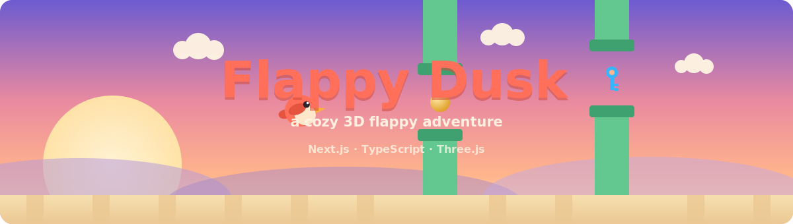
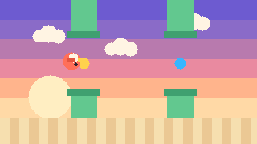

  

<h1 align="center">Flappy Dusk</h1>

  A pretty, playable <b>3D flappy-bird</b> game — coins, power-ups, rare keys,
  daily missions, levels, and a bird shop. 
  Built with <b>Next.js</b>, <b>TypeScript</b>, and <b>Three.js</b>.

  
  
  
  
  
  

---

## Demo

  

> The GIF above is a **stylized preview** of the game loop. To drop in a real
> screen recording, see [Recording your own demo](#recording-your-own-demo).

